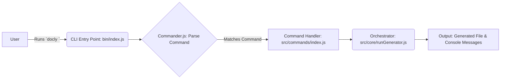
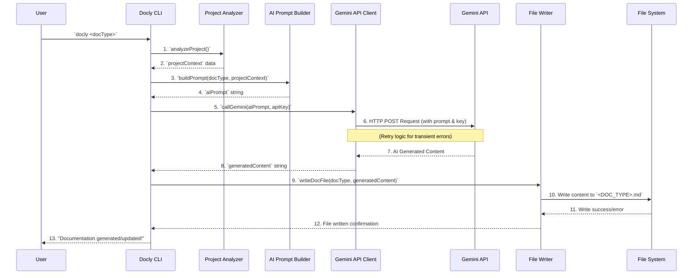
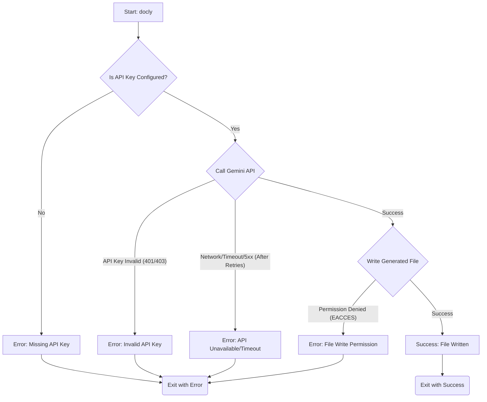

Docly CLI Workflow Documentation

## Introduction

Docly CLI is a command-line interface tool designed to automate the generation of project documentation using Google's Gemini AI. It operates entirely on the local machine, analyzing project files, constructing AI prompts, interacting with the Gemini API, and saving the generated content directly to the project directory. There are no web interfaces, user accounts, databases, or complex authentication mechanisms involved beyond API key management for Gemini.

**Tech Stack:** Node.js CLI (Commander.js, local file system operations, HTTP client for Gemini API).

---

## 1. User Workflows

This section outlines how a user interacts with the Docly CLI from installation to document generation.

### 1.1. First-Time Setup Workflow

**Objective:** Get Docly CLI installed and configured for use.

1.  **Install Docly CLI:**
    *   User opens their terminal.
    *   User executes the global installation command: `npm install -g docly-cli`
    *   NPM downloads and installs Docly CLI, making the `docly` command available globally.
    *   **Success:** `docly` command is recognized.
    *   **Failure:** NPM installation error (e.g., network issues, permission errors).
2.  **Configure Gemini API Key:**
    *   User obtains a Gemini API key from Google AI Studio.
    *   User executes the configuration command: `docly config set gemini-api-key YOUR_GEMINI_API_KEY`
    *   Docly CLI stores the API key securely (e.g., in a local configuration file, typically `~/.config/docly/config.json` or similar).
    *   **Success:** API key is saved.
    *   **Failure:** Invalid key format (though Docly might not validate format immediately, only when used).

### 1.2. Command Execution Workflow

**Objective:** Understand the general flow when a user runs any `docly` command.

1.  **User Initiates Command:**
    *   User navigates to their project directory in the terminal.
    *   User types a `docly` command, e.g., `docly readme`.
    *   User presses Enter.
2.  **CLI Entry Point Activation:**
    *   The operating system executes the `docly` binary (linked to `bin/index.js`).
3.  **Command Parsing:**
    *   `commander.js` (within `bin/index.js`) receives the command and any arguments/options.
    *   It matches the input (`readme`) to a registered command handler.
4.  **Command Handler Execution:**
    *   The corresponding command handler function (e.g., `readmeCommand` in `src/commands/index.js`) is invoked.
5.  **Output/Feedback:**
    *   The CLI provides immediate feedback (e.g., "Generating README.md...") and progress indicators.
    *   Upon completion (success or failure), it prints a final status message.

### 1.3. Documentation Generation Workflow

**Objective:** Generate a specific type of documentation.

1.  **User Requests Document:**
    *   User runs a command like `docly srs` in their project root.
2.  **Project Analysis:**
    *   Docly CLI identifies the project root.
    *   It scans the project directory, reads relevant files (e.g., source code, `package.json`, existing markdown files).
    *   It extracts structural information, dependencies, and file contents.
3.  **AI Prompt Construction:**
    *   Based on the analyzed project data and the requested document type (SRS), a detailed prompt is dynamically built for the Gemini AI. This prompt includes context, project structure, and relevant code/file snippets.
4.  **Gemini API Interaction:**
    *   The constructed prompt is sent to the Gemini API.
    *   Docly CLI awaits the AI's response, handling potential network issues or timeouts with retry logic.
5.  **Content Processing:**
    *   The AI's generated text content is received.
    *   (Optional) Basic post-processing might occur (e.g., formatting adjustments).
6.  **File Writing:**
    *   The generated content is written to a new file (e.g., `SRS.md`) in the project root.
7.  **Completion Notification:**
    *   Docly CLI prints a success message, indicating the file has been created/updated.

### 1.4. Regenerating Documentation Workflow

**Objective:** Update existing documentation after project changes.

1.  **User Modifies Project:**
    *   User makes changes to their project's code, structure, or dependencies.
2.  **User Requests Regeneration:**
    *   User runs the same `docly` command again, e.g., `docly readme`.
3.  **Docly Re-executes Generation Workflow:**
    *   The CLI performs the exact "Documentation Generation Workflow" (Section 1.3) from scratch.
    *   It re-analyzes the *current* state of the project.
    *   It generates a new AI prompt.
    *   It calls the Gemini API.
    *   It receives new content.
4.  **File Overwriting:**
    *   When writing the new documentation, Docly CLI overwrites the existing file (e.g., `README.md`) with the freshly generated content.
5.  **Completion Notification:**
    *   Docly CLI confirms that the documentation has been updated.

---

## 2. System Workflows

This section details the internal processes within the Docly CLI.

### 2.1. Command Parsing (Commander.js)

1.  **Entry Point Activation:** `bin/index.js` is executed by Node.js.
2.  **Commander Initialization:** `commander.js` is initialized, defining the main program and global options.
3.  **Command Registration:** Each specific command (`readme`, `srs`, `architecture`, `workflow`, `testcases`, `config`) is registered with `commander.js`. This includes defining its description and linking it to a specific asynchronous handler function.
4.  **Argument Parsing:** `commander.js` parses `process.argv` (the command-line arguments).
5.  **Handler Dispatch:** Based on the parsed command, `commander.js` invokes the associated handler function, passing any parsed options or arguments.

### 2.2. Project Analysis (Reading Files)

1.  **Determine Project Root:** Docly identifies the current working directory as the likely project root. It might also traverse up to find a `package.json` file to confirm.
2.  **File Discovery:** It recursively scans the project directory, respecting `.gitignore` or a custom `.doclyignore` file to exclude irrelevant files and directories (e.g., `node_modules`, `dist`).
3.  **File Filtering:** It filters discovered files based on type (e.g., `.js`, `.ts`, `.jsx`, `.tsx`, `.mjs`, `.cjs`, `package.json`, `.md` for existing docs).
4.  **Content Reading:** For each relevant file, Docly reads its entire content into memory.
5.  **Data Extraction & Structuring:**
    *   For `package.json`: Extracts project name, description, dependencies, scripts.
    *   For source code files: Extracts filenames, potentially function/class names, comments, and the code content itself.
    *   The extracted data is structured into a comprehensive "project context" object.

### 2.3. AI Prompt Building

1.  **Receive Project Context:** The structured data from the "Project Analysis" workflow is passed to the prompt builder.
2.  **Identify Document Type:** The specific documentation requested (e.g., `README`, `SRS`) determines the core instructions for the AI.
3.  **Template Selection:** A base prompt template is selected for the given document type.
4.  **Dynamic Prompt Construction:**
    *   The template is populated with project-specific details (e.g., project name, description, dependencies).
    *   Relevant file contents and structural information are injected, often in a structured format (e.g., Markdown code blocks, JSON snippets).
    *   Specific instructions are added based on the document type (e.g., "explain how to install and run," "describe the system's functional requirements").
    *   Constraints are added (e.g., "output in Markdown format," "keep it concise").
5.  **Final Prompt Assembly:** The complete, detailed prompt string is returned, ready for the Gemini API.

### 2.4. Gemini API Call Workflow

1.  **Receive Prompt & API Key:** The constructed prompt and the configured Gemini API key are provided.
2.  **API Request Construction:**
    *   An HTTP POST request is prepared for the Gemini API endpoint (e.g., `https://generativelanguage.googleapis.com/v1beta/models/gemini-pro:generateContent`).
    *   The API key is included in the headers (e.g., `x-goog-api-key`).
    *   The prompt is formatted into the request body as per Gemini API specifications (e.g., `{"contents": [{"parts": [{"text": "Your prompt here"}]}]}`).
    *   Configuration for generation (e.g., `temperature`, `maxOutputTokens`) is included.
3.  **Execute API Call (with Retry Logic):**
    *   An HTTP client (e.g., `axios`) sends the request.
    *   **Retry Mechanism:**
        *   If the initial call fails due to transient errors (e.g., network timeout, 500/503 status codes), a retry mechanism is activated.
        *   It waits for an increasing duration (exponential backoff).
        *   It retries the request up to a predefined number of attempts.
4.  **Response Handling:**
    *   **Success:** If the API call is successful, the response body is parsed to extract the generated text content.
    *   **Failure:** If all retries fail or a non-transient error occurs (e.g., 401/403 for invalid API key), the error is caught and propagated.
5.  **Return Generated Content:** The extracted AI-generated text is returned.

### 2.5. File Writing Workflow

1.  **Receive Content & Target Path:** The AI-generated documentation content and the desired output filename (e.g., `README.md`) are provided.
2.  **Path Resolution:** The full path to the output file is constructed (e.g., `./README.md` in the current working directory).
3.  **Directory Check/Creation:** Docly checks if the target directory exists. If not, it creates it.
4.  **File Write Operation:**
    *   The Node.js `fs.writeFile` (or `fs.promises.writeFile`) function is used to write the content to the specified path.
    *   The encoding is set (typically UTF-8).
    *   **Overwrite Behavior:** By default, `fs.writeFile` overwrites existing files.
5.  **Error Handling:** Any errors during file writing (e.g., permission denied, disk full) are caught and reported.
6.  **Confirmation:** Upon successful write, a confirmation message is generated.

---

## 3. Internal Component Workflows

This section details the flow of control between key internal modules.

### 3.1. `bin/index.js` → `src/commands/index.js` Flow

1.  **`bin/index.js` (CLI Entry Point):**
    *   Initializes `commander.js`.
    *   Imports and registers all commands from `src/commands/index.js`.
    *   `program.parse(process.argv)` is called, which triggers `commander.js` to match the input command.
2.  **`src/commands/index.js` (Command Definitions):**
    *   Exports functions for each command (e.g., `readmeCommand`, `srsCommand`, `configCommand`).
    *   These functions are registered as handlers with `commander.js` in `bin/index.js`.
    *   When a command is executed, `commander.js` calls the corresponding function from this module.

### 3.2. `src/commands` → `src/core/runGenerator.js` Flow

1.  **Command Handler (e.g., `readmeCommand` in `src/commands/index.js`):**
    *   Upon execution, the command handler primarily acts as an orchestrator.
    *   It determines the `docType` (e.g., `'readme'`) based on the command.
    *   It calls the central `runGenerator` function, passing the `docType` and any relevant options.
2.  **`src/core/runGenerator.js` (Core Generation Logic):**
    *   This function encapsulates the entire documentation generation process.
    *   It takes the `docType` as an argument and coordinates the subsequent steps.

### 3.3. `runGenerator` → `analyzer` → `generateDoc` Flow

1.  **`runGenerator` (Orchestrator):**
    *   **Step 1: Project Analysis:** Calls the `analyzer` module (e.g., `import { analyzeProject } from '../analyzer';`).
        *   `const projectContext = await analyzeProject();`
    *   **Step 2: Documentation Generation:** Calls the `generateDoc` module (e.g., `import { generateDocument } from './generateDoc';`).
        *   `const generatedContent = await generateDocument(docType, projectContext);`
    *   **Step 3: File Writing:** Calls the `fileWriter` module (e.g., `import { writeDocFile } from '../fileWriter';`).
        *   `await writeDocFile(docType, generatedContent);`
2.  **`analyzer` Module:**
    *   Receives no direct arguments from `runGenerator` (it determines its own context).
    *   Performs the "Project Analysis" workflow (reads files, extracts data).
    *   Returns the `projectContext` object to `runGenerator`.
3.  **`generateDoc` Module:**
    *   Receives `docType` and `projectContext` from `runGenerator`.
    *   Performs the "AI Prompt Building" workflow.
    *   Performs the "Gemini API Call" workflow (internally calling the AI client).
    *   Returns the AI-generated content string to `runGenerator`.

### 3.4. AI Client Workflow (`callGemini` with Retry Logic)

1.  **`generateDoc` (or similar high-level function):**
    *   Calls an internal AI client function (e.g., `import { callGemini } from '../services/geminiClient';`).
    *   `const aiResponse = await callGemini(prompt, apiKey);`
2.  **`geminiClient.js` (`callGemini` function):**
    *   Receives the prompt and API key.
    *   **Initial API Call:** Makes the first HTTP request to the Gemini API.
    *   **Retry Loop:**
        *   If an error occurs (e.g., network error, 5xx status code), it checks if it's a retriable error.
        *   If retriable, it waits for `delayMs` (exponentially increasing) and decrements `retryCount`.
        *   It attempts the API call again.
        *   This loop continues until success or `retryCount` reaches zero.
    *   **Error Handling:** Catches specific errors (e.g., 401/403 for API key, network errors).
    *   **Response Parsing:** Extracts the generated text from the successful API response.
    *   Returns the parsed text.

---

## 4. Error Handling Workflows

This section describes how Docly CLI handles common errors gracefully.

### 4.1. Missing API Key Error

1.  **Trigger:** Docly attempts to call the Gemini API, but the `gemini-api-key` is not found in its configuration.
2.  **Detection:** The `geminiClient` module (or an earlier configuration check) detects the absence of the key.
3.  **Action:**
    *   Prints a critical error message to `stderr`: "Error: Gemini API key is not configured."
    *   Provides remediation instructions: "Please set your API key using `docly config set gemini-api-key YOUR_KEY`."
    *   Exits the process with a non-zero exit code (e.g., `process.exit(1)`).

### 4.2. Invalid API Key Error

1.  **Trigger:** Docly calls the Gemini API with an API key that Gemini rejects (e.g., expired, revoked, malformed).
2.  **Detection:** The Gemini API responds with an HTTP 401 (Unauthorized) or 403 (Forbidden) status code. The `geminiClient` catches this specific HTTP error.
3.  **Action:**
    *   Prints an error message to `stderr`: "Error: Invalid Gemini API key. Please check your key and try again."
    *   Suggests remediation: "You can update it using `docly config set gemini-api-key YOUR_NEW_KEY`."
    *   Exits the process with a non-zero exit code.

### 4.3. API Timeout/503 Errors

1.  **Trigger:** The Gemini API is temporarily unavailable, overloaded, or a network issue prevents a timely response. This results in HTTP 500/502/503 status codes or network timeouts.
2.  **Detection:**
    *   The `geminiClient`'s retry logic first attempts to re-send the request.
    *   If all retries fail, the final error is caught.
3.  **Action:**
    *   Prints an error message to `stderr`: "Error: Gemini API is currently unavailable or timed out after multiple retries. Please try again later."
    *   Provides context: "This might be due to network issues or temporary service outages."
    *   Exits the process with a non-zero exit code.

### 4.4. File Write Permission Errors

1.  **Trigger:** Docly attempts to write the generated documentation file to disk, but the operating system denies the write operation due to insufficient permissions.
2.  **Detection:** The `fs.writeFile` (or equivalent) call throws an `EACCES` or `EPERM` error. The `fileWriter` module catches this specific error.
3.  **Action:**
    *   Prints an error message to `stderr`: "Error: Permission denied when trying to write to [filepath]. Please check your file permissions."
    *   Suggests remediation: "Ensure you have write access to the target directory."
    *   Exits the process with a non-zero exit code.

---

## 5. Diagrams (Mermaid)

### 5.1. High-Level Command Execution Flow

### 5.2. Detailed Documentation Generation Sequence

### 5.3. Error Handling Flowchart

