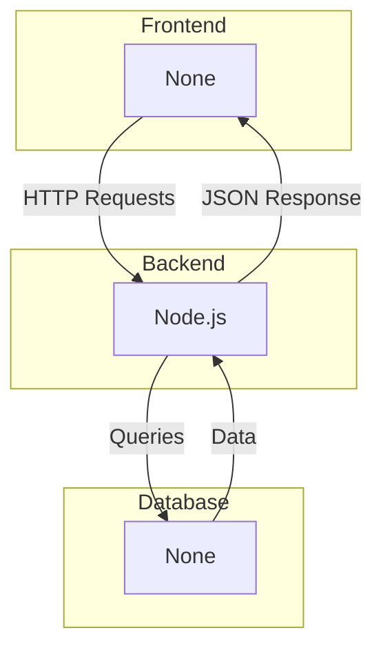

# System Architecture - docly-cli

## High-Level Architecture

  

## Technology Stack

- **Frontend**: None
- **Backend**: Node.js
- **Database**: None
- **Authentication**: None

## Components

### Frontend
The frontend is built with None, providing a modern user interface.

### Backend
The backend uses Node.js to handle API requests and business logic.

### Database
Data is stored in None, providing reliable data persistence.

## Dependencies

- @google/genai
- axios
- chalk
- commander
- dotenv
- fs-extra
- ora
