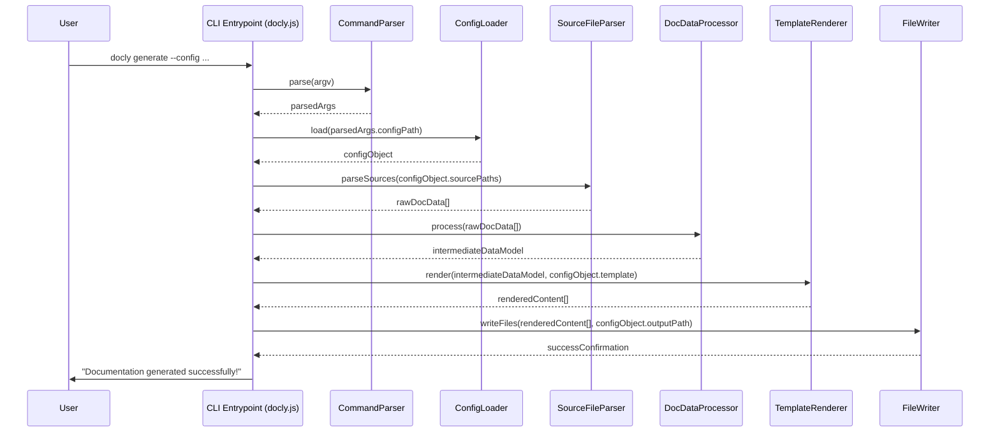
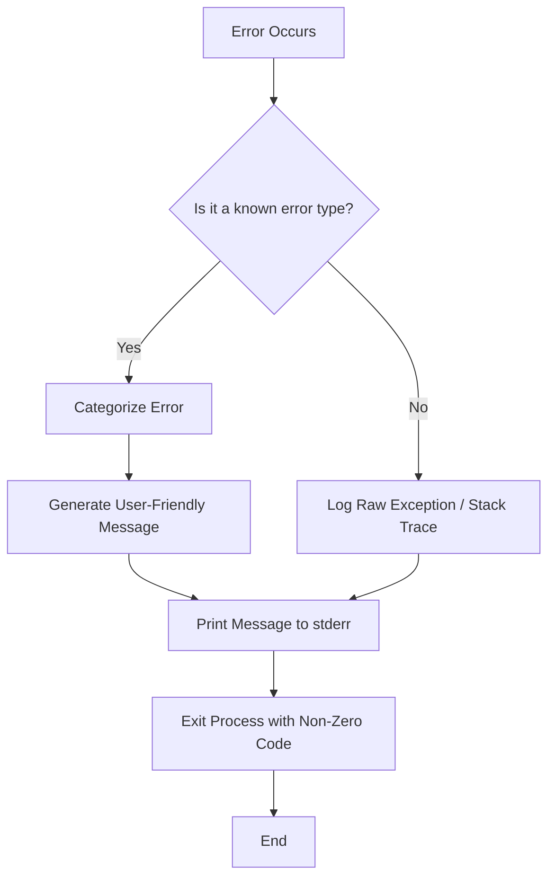

This document outlines the comprehensive workflows for the `docly-cli` project, a command-line interface built with Node.js. Given its nature as a CLI and the specified lack of authentication, certain traditional web application workflows (like user registration/login) are not applicable and will be explicitly noted as such.

---

## 1. User Workflows

### 1.1. User Registration and Login Flow

*   **Description:** As `docly-cli` is a command-line interface application without an integrated user management system or external authentication requirements, there is no user registration or login flow. Users interact directly with the CLI via their terminal.
*   **Steps:** Not Applicable.
*   **Expected Outcome:** Not Applicable.
*   **Error Scenarios:** Not Applicable.

### 1.2. Main Feature Workflows

This section describes the typical interaction patterns for core `docly-cli` functionalities.

#### 1.2.1. Initialize a New Docly Project

*   **Description:** A user wants to set up `docly-cli` in a new or existing project directory to begin generating documentation.
*   **Steps:**
    1.  User navigates to their project directory in the terminal.
    2.  User executes the initialization command: `docly init`
    3.  CLI prompts the user for basic configuration (e.g., source directory, output directory, template choice).
    4.  User provides necessary inputs or accepts defaults.
    5.  CLI creates a `docly.config.js` (or similar) file in the current directory.
*   **Expected Outcome:** A `docly.config.js` file is created in the project root, containing the initial configuration. The project is now ready for documentation generation.
*   **Error Scenarios:**
    *   **Directory permissions:** CLI cannot write `docly.config.js`.
    *   **Existing config file:** CLI warns the user and asks if they want to overwrite (or exits if not confirmed).
    *   **Invalid inputs:** User provides non-existent paths or invalid options; CLI provides immediate feedback and prompts again or exits.

#### 1.2.2. Generate Documentation

*   **Description:** After initializing, the user wants to generate documentation based on their source code and configuration.
*   **Steps:**
    1.  User navigates to the project directory containing `docly.config.js`.
    2.  User executes the generation command: `docly generate`
    3.  CLI reads `docly.config.js` to determine source files, output location, and templates.
    4.  CLI parses source files, extracts documentation comments/metadata.
    5.  CLI applies selected templates to the extracted data.
    6.  CLI writes the generated documentation files to the specified output directory.
*   **Expected Outcome:** A directory (e.g., `docs/`) is created or updated with the latest generated documentation files (e.g., HTML, Markdown).
*   **Error Scenarios:**
    *   **Missing config file:** CLI reports `docly.config.js` not found and suggests running `docly init`.
    *   **Invalid config:** CLI reports parsing errors or invalid values in `docly.config.js`.
    *   **Source file errors:** CLI encounters unreadable or malformed source files; reports errors and potentially continues with other files.
    *   **Template errors:** Selected template is missing or has rendering issues; CLI reports template error.
    *   **Output directory permissions:** CLI cannot write to the output directory.

#### 1.2.3. Watch for Changes and Regenerate

*   **Description:** The user wants `docly-cli` to continuously monitor source files for changes and automatically regenerate documentation.
*   **Steps:**
    1.  User navigates to the project directory.
    2.  User executes the watch command: `docly watch`
    3.  CLI performs an initial documentation generation (as per 1.2.2).
    4.  CLI then sets up a file system watcher on the configured source directories.
    5.  Upon detecting a change in a source file, CLI triggers a regeneration process.
    6.  CLI logs regeneration status to the console.
*   **Expected Outcome:** The CLI remains active, monitoring files. Any changes to source files automatically trigger a documentation regeneration, keeping the output documentation up-to-date.
*   **Error Scenarios:**
    *   **Initial generation failure:** Same as `docly generate` errors; CLI reports, might exit or continue watching.
    *   **File watcher limits:** OS limits on open file descriptors might be reached for very large projects.
    *   **Regeneration errors during watch:** CLI reports errors but continues watching for subsequent changes.

### 1.3. User Journey from Entry to Completion

This describes the typical lifecycle of a user interacting with `docly-cli`.

*   **Description:** The complete path a user takes from discovering `docly-cli` to successfully using it to generate and maintain documentation.
*   **Steps:**
    1.  **Discovery:** User identifies a need for documentation generation and searches for CLI tools (e.g., via npm, GitHub, search engines).
    2.  **Installation:** User finds `docly-cli` and installs it globally: `npm install -g docly-cli`.
    3.  **Initial Setup:** User navigates to their project and initializes `docly-cli`: `docly init`. They configure basic settings.
    4.  **First Generation:** User runs `docly generate` to create initial documentation.
    5.  **Review & Refine:** User reviews the generated documentation, adjusts source code comments, or modifies `docly.config.js` to refine output.
    6.  **Continuous Workflow:** User integrates `docly watch` into their development flow or adds `docly generate` to CI/CD pipelines.
    7.  **Maintenance:** User updates `docly-cli` periodically (`npm update -g docly-cli`) and adjusts configurations as their project evolves.
*   **Expected Outcome:** User successfully integrates `docly-cli` into their development process, consistently generating and maintaining up-to-date documentation for their projects.
*   **Error Scenarios:**
    *   **Installation failure:** Network issues, permissions, Node.js version incompatibility.
    *   **Configuration issues:** Incorrect paths, invalid settings leading to generation failures.
    *   **Content generation issues:** Source code parsing errors, template rendering problems.
    *   **Integration challenges:** Difficulty integrating into CI/CD or specific project setups.

#### 1.3.1. User Project State Diagram

```mermaid
stateDiagram
    direction LR
    [*] --> Uninitialized: Discover & Install
    Uninitialized --> Initialized: docly init
    Initialized --> DocsGenerated: docly generate
    DocsGenerated --> DocsUpdated: docly watch / docly generate (changes detected)
    DocsGenerated --> Initialized: Modify config / Delete docs
    DocsUpdated --> DocsUpdated: Source code changes / docly watch
    DocsUpdated --> Initialized: Modify config / Delete docs
    Initialized --> [*]: Uninstall / Project abandoned
    DocsGenerated --> [*]: Uninstall / Project abandoned
    DocsUpdated --> [*]: Uninstall / Project abandoned

    state Failed {
        Uninitialized --> Failed: Init error
        Initialized --> Failed: Generation error
        DocsGenerated --> Failed: Update error
        DocsUpdated --> Failed: Update error
        Failed --> Initialized: Fix config / Source code
        Failed --> Uninitialized: Reset project
    }
```

---

## 2. System Workflows

### 2.1. Command Execution Lifecycle

*   **Description:** This workflow details how `docly-cli` processes a user-issued command from initial input to final output.
*   **Steps:**
    1.  **User Input:** User types a command (e.g., `docly generate --output docs`) in the terminal.
    2.  **Shell Execution:** The operating system shell interprets `docly` as an executable (linked via npm global install) and executes the Node.js script.
    3.  **CLI Framework Initialization:** The main `docly-cli` script (e.g., `bin/docly.js`) starts, typically using a CLI framework like `Commander.js` or `Yargs`.
    4.  **Argument Parsing:** The CLI framework parses command-line arguments, options, and flags (`generate`, `--output`, `docs`).
    5.  **Command Dispatch:** Based on the parsed command, the CLI framework dispatches control to the relevant internal command handler function (e.g., `generateCommand.run()`).
    6.  **Configuration Loading:** The command handler loads the project's configuration (e.g., `docly.config.js`).
    7.  **Core Logic Execution:** The command's specific logic is executed (e.g., source file parsing, documentation generation, file writing).
    8.  **Output Generation:** Results, status messages, or errors are printed to `stdout` or `stderr`. Generated files are written to the filesystem.
    9.  **Process Exit:** The Node.js process exits with an appropriate exit code (0 for success, non-zero for error).
*   **Expected Outcome:** The requested operation is performed, relevant output is displayed in the terminal, and the process exits.
*   **Error Scenarios:**
    *   **Invalid command/arguments:** CLI framework catches and prints usage help or specific error messages.
    *   **Configuration errors:** Internal logic fails to load/parse config; exits with error.
    *   **Runtime exceptions:** Uncaught errors during core logic execution; process exits with a stack trace.

#### 2.1.1. Command Execution Flowchart

```mermaid
graph TD
    A[User Types Command] --> B(Shell Executes Node.js Script)
    B --> C{CLI Framework Init & Arg Parsing}
    C --> D{Validate Command & Args}
    D -- Valid --> E[Dispatch to Command Handler]
    D -- Invalid --> F[Display Help / Error & Exit]

    E --> G[Load Project Configuration]
    G --> H[Execute Core Command Logic]
    H --> I[Generate Output (Console/Files)]
    I --> J[Exit Process (Success/Error Code)]

    F --> K[End]
    J --> K
```

### 2.2. Data Flow Through the System

*   **Description:** This workflow describes how data is processed and transformed within `docly-cli` from input to output.
*   **Steps:**
    1.  **Input Acquisition:**
        *   **CLI Arguments:** `process.argv` provides command, options, flags.
        *   **Configuration File:** `fs.readFile` reads `docly.config.js` (JSON/JS object).
        *   **Source Files:** `fs.readFile` reads project source code files (e.g., `.js`, `.ts`, `.jsx`, `.tsx`).
        *   **Templates:** `fs.readFile` reads template files (e.g., `.hbs`, `.ejs`).
    2.  **Parsing & Validation:**
        *   CLI framework parses arguments into structured command objects.
        *   Configuration parser validates `docly.config.js` schema.
        *   Source code parser (e.g., AST parser like `Acorn`, `Babel`, `TypeScript Compiler API`) transforms code into an Abstract Syntax Tree (AST).
        *   Docblock parser extracts comments and metadata from AST nodes.
    3.  **Data Transformation (Internal Representation):**
        *   Extracted documentation data (e.g., function signatures, parameters, descriptions, examples) is transformed into a standardized, language-agnostic intermediate data model (IDM).
        *   The IDM is enriched with file paths, line numbers, and other contextual information.
    4.  **Template Application:**
        *   The IDM is passed to a templating engine (e.g., Handlebars, EJS).
        *   The templating engine renders the IDM into target documentation format (e.g., HTML, Markdown) using the selected templates.
    5.  **Output Generation:**
        *   Rendered documentation strings are written to files in the specified output directory (`fs.writeFile`).
        *   Console messages (status, warnings, errors) are printed to `stdout`/`stderr`.
*   **Expected Outcome:** Raw input (source code, config) is transformed into structured documentation files and console feedback.
*   **Error Scenarios:**
    *   **Input parsing errors:** Malformed config, unparseable source code.
    *   **IDM generation errors:** Failure to extract or normalize data from AST.
    *   **Template rendering errors:** Invalid template syntax, missing data in IDM.
    *   **Output writing errors:** Permissions issues, disk full.

### 2.3. Authentication and Authorization Flow

*   **Description:** `docly-cli` does not implement any user authentication or authorization mechanisms. It operates directly on local files and relies on the user's operating system permissions.
*   **Steps:** Not Applicable.
*   **Expected Outcome:** Not Applicable.
*   **Error Scenarios:** Not Applicable.

---

## 3. API Workflows (Internal Module Interactions)

For `docly-cli`, "API" refers to the internal programmatic interfaces between its modules and components, rather than external web APIs.

### 3.1. Typical Internal API Call Sequences (Generate Command)

*   **Description:** This sequence diagram illustrates the interaction between key internal modules during the `docly generate` command execution.
*   **Steps:**
    1.  `CLI_Entrypoint` (main `docly.js` script) receives the `generate` command.
    2.  It instantiates and calls the `CommandParser` to process arguments.
    3.  `CommandParser` returns validated arguments to `CLI_Entrypoint`.
    4.  `CLI_Entrypoint` then instantiates `ConfigLoader` and requests the project configuration.
    5.  `ConfigLoader` reads `docly.config.js` and returns the config object.
    6.  `CLI_Entrypoint` creates `SourceFileParser` and passes the configured source paths.
    7.  `SourceFileParser` reads and parses source files, extracting raw documentation data.
    8.  `CLI_Entrypoint` then passes this raw data to `DocDataProcessor`.
    9.  `DocDataProcessor` transforms raw data into the standardized Intermediate Data Model (IDM).
    10. `CLI_Entrypoint` instantiates `TemplateRenderer` with the IDM and configured template.
    11. `TemplateRenderer` generates the final documentation content.
    12. `CLI_Entrypoint` creates `FileWriter` and instructs it to write the generated content to the output directory.
    13. `FileWriter` writes the files and confirms completion.
    14. `CLI_Entrypoint` logs success to the console and exits.
*   **Expected Outcome:** Documentation files are successfully generated and written to disk.
*   **Error Scenarios:** Each interaction point can throw errors (e.g., `ConfigLoader` fails to read, `SourceFileParser` encounters syntax errors, `FileWriter` has permission issues). Errors are typically caught by the calling module and propagated up to `CLI_Entrypoint` for graceful error handling and exit.

#### 3.1.1. Generate Command Sequence Diagram



### 3.2. Request Processing Pipeline (Argument to Action)

*   **Description:** This workflow describes the internal pipeline from receiving command-line arguments to executing the specific action logic.
*   **Steps:**
    1.  **Raw Arguments:** `process.argv` contains the raw command-line input.
    2.  **CLI Framework Parsing:** A CLI library (e.g., `Commander.js`) parses `process.argv` into a structured object representing the command, sub-command, options, and arguments.
    3.  **Argument Validation:** The parsed arguments are validated against predefined schemas for the command. This includes type checking, required fields, and acceptable values.
    4.  **Command Mapping:** The validated command is mapped to its corresponding internal handler function.
    5.  **Dependency Injection/Context Setup:** The handler function (or its dependencies) might receive a context object containing configuration, logger instances, or other shared resources.
    6.  **Business Logic Execution:** The core logic for the command is executed, leveraging other internal modules (e.g., `ConfigLoader`, `SourceFileParser`, `TemplateRenderer`).
    7.  **Output Formatting & Display:** Results from the business logic are formatted for terminal display (e.g., colorized messages, progress bars) and printed.
    8.  **Exit Code:** The process exits with an appropriate status code.
*   **Expected Outcome:** The CLI command is correctly interpreted, validated, and its intended action is performed, with clear feedback to the user.
*   **Error Scenarios:**
    *   **Parsing errors:** Unrecognized commands or options.
    *   **Validation errors:** Missing required arguments, invalid argument types.
    *   **Logic execution errors:** Any runtime error during the business logic phase.

### 3.3. Error Handling Workflow

*   **Description:** This workflow outlines how `docly-cli` identifies, processes, and reports errors to the user, aiming for a graceful exit.
*   **Steps:**
    1.  **Error Occurrence:** An error occurs at any stage (e.g., argument parsing, file I/O, configuration loading, data processing, template rendering).
    2.  **Error Catching:**
        *   **Local Try-Catch:** Specific functions/modules use `try-catch` blocks to handle expected errors gracefully (e.g., `fs` operations, JSON parsing).
        *   **Promise Rejection:** Asynchronous operations return rejected Promises.
        *   **Global Uncaught Exception Handler:** A top-level `process.on('uncaughtException')` or `process.on('unhandledRejection')` catches any errors that bubble up.
    3.  **Error Categorization:** Errors are categorized (e.g., `ValidationError`, `ConfigError`, `FileSystemError`, `ParsingError`).
    4.  **Error Logging:** The error details (message, stack trace) are logged internally for debugging (e.g., to a debug log file if enabled, or to `stderr`).
    5.  **User-Friendly Message Generation:** A concise, actionable error message is generated for the user, avoiding raw stack traces for common errors. This might include suggestions for resolution (e.g., "Config file not found. Run `docly init`").
    6.  **Console Output:** The user-friendly error message is printed to `stderr` (often in red).
    7.  **Process Exit:** The Node.js process exits with a non-zero exit code (e.g., 1) to indicate failure, which is crucial for scripting and CI/CD environments.
*   **Expected Outcome:** Users receive clear, actionable feedback when an error occurs, allowing them to diagnose and fix the issue. The CLI exits gracefully without crashing abruptly.
*   **Error Scenarios:**
    *   **Uncatchable errors:** Extremely rare, but hardware failures or critical OS issues could prevent even the global handler from firing.
    *   **Misleading error messages:** If error categorization or message generation is flawed, users might receive confusing information.

#### 3.3.1. Error Handling Flowchart



---

## 4. Development Workflows

### 4.1. Local Development Setup

*   **Description:** Steps for a developer to set up `docly-cli` for local development, allowing them to modify code and test changes.
*   **Steps:**
    1.  **Prerequisites:** Ensure Node.js (LTS version recommended) and npm are installed.
    2.  **Clone Repository:** `git clone https://github.com/your-org/docly-cli.git`
    3.  **Navigate to Directory:** `cd docly-cli`
    4.  **Install Dependencies:** `npm install` (installs project dependencies from `package.json`).
    5.  **Link Executable (for local testing):** `npm link` (This creates a global symlink from your local `docly-cli` directory to your system's `node_modules` bin directory, making `docly` command available globally and pointing to your local code).
    6.  **Create Test Project:** Create a separate directory for testing (`mkdir test-project && cd test-project`).
    7.  **Test Locally:** Run `docly init` or `docly generate` within your `test-project` to verify the local `docly-cli` installation is working.
    8.  **Development Loop:** Make code changes in the `docly-cli` directory, then run tests or use the `docly` command in your `test-project` to see changes. No re-installation is needed after `npm link`.
*   **Expected Outcome:** The developer can execute the `docly` command globally, with the command pointing to their local, editable source code, enabling rapid iteration.
*   **Error Scenarios:**
    *   **Node.js/npm issues:** Incorrect versions or installation problems.
    *   **`npm link` permissions:** On some systems, `npm link` might require elevated privileges.
    *   **Dependency installation failure:** Network issues, package conflicts.

### 4.2. Code Review Process

*   **Description:** The process for ensuring code quality, maintainability, and correctness through peer review.
*   **Steps:**
    1.  **Feature/Bug Branch:** Developer creates a new branch from `main` (e.g., `feature/add-watch-mode`, `bugfix/config-parse-error`).
    2.  **Development & Testing:** Developer implements the feature/fix and writes/updates unit and integration tests.
    3.  **Local Verification:** Developer runs all tests locally and verifies the change works as expected.
    4.  **Commit & Push:** Developer commits changes with descriptive messages and pushes the branch to the remote repository.
    5.  **Pull Request (PR) Creation:** Developer opens a Pull Request on GitHub (or equivalent platform) targeting the `main` branch.
    6.  **PR Description:** Developer provides a clear description of the changes, motivation, testing notes, and links to any related issues.
    7.  **Automated Checks:** CI/CD pipeline runs automated tests, linting, and other checks on the PR branch.
    8.  **Peer Review:** One or more team members review the code, providing feedback, suggestions, and requesting changes.
    9.  **Address Feedback:** Original developer addresses feedback, pushes new commits to the branch, and requests re-review.
    10. **Approval & Merge:** Once approved and all automated checks pass, the PR is merged into the `main` branch.
    11. **Branch Deletion:** The feature/bugfix branch is deleted after merging.
*   **Expected Outcome:** High-quality, well-tested code is integrated into the `main` branch, adhering to project standards.
*   **Error Scenarios:**
    *   **Failed CI checks:** Linting errors, failing tests block merge.
    *   **Disagreements in review:** Requires discussion and consensus.
    *   **Stale PRs:** PRs sit unreviewed or unaddressed for too long.

### 4.3. Deployment Workflow

*   **Description:** The process of releasing a new version of `docly-cli` to the npm registry, making it available to users.
*   **Steps:**
    1.  **Ensure Main is Up-to-Date:** Pull the latest changes from the `main` branch.
    2.  **Clean Build (if applicable):** If the project uses TypeScript or requires transpilation, ensure a clean build is performed (e.g., `npm run build`).
    3.  **Run All Tests:** `npm test` to ensure all tests pass on the `main` branch.
    4.  **Version Bump:** Use `npm version <patch|minor|major>` to increment the version number in `package.json` and create a Git tag.
    5.  **Push Changes & Tag:** `git push origin main --tags` to push the updated `package.json` and the new version tag.
    6.  **Publish to npm:** `npm publish` (Ensure you are logged into npm via `npm login` and have the necessary permissions for the package).
    7.  **Announce Release (Optional):** Communicate the new release to users (e.g., GitHub release notes, changelog update, social media).
*   **Expected Outcome:** A new version of `docly-cli` is successfully published to the npm registry, accessible by users via `npm install -g docly-cli`.
*   **Error Scenarios:**
    *   **Failed tests:** Prevents publishing.
    *   **npm authentication errors:** Not logged in, incorrect credentials.
    *   **Version conflict:** Trying to publish a version that already exists.
    *   **Network issues:** Prevents connection to npm registry.

#### 4.3.1. Deployment Flowchart

```mermaid
graph TD
    A[Start Deployment] --> B{Ensure Main Branch is Latest};
    B --> C[Run All Tests (npm test)];
    C -- Tests Pass --> D[Increment Version (npm version)];
    C -- Tests Fail --> E[Fix Tests & Re-run];
    D --> F[Push Main Branch & Tags (git push)];
    F --> G[Publish to npm (npm publish)];
    G -- Success --> H[Announce Release (Optional)];
    G -- Failure --> I[Troubleshoot npm publish];
    H --> J[End];
    I --> J;
```